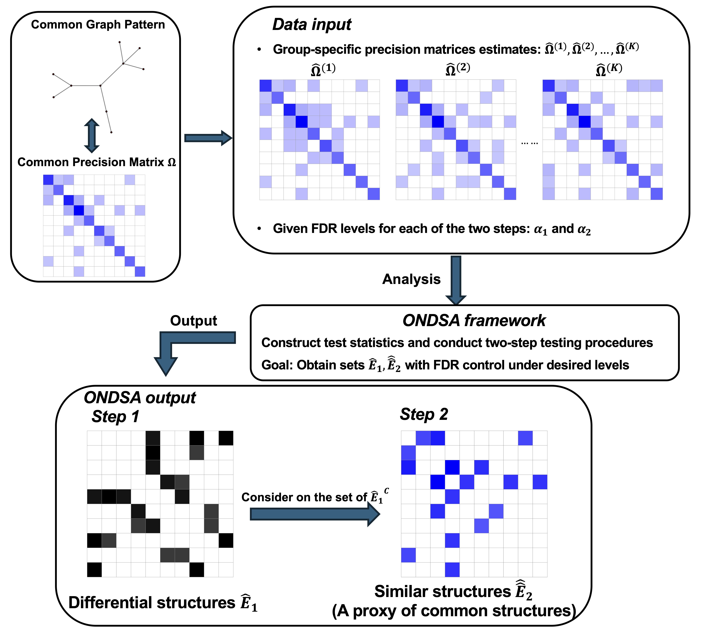

# ONDSA: Omics Networks Differential and Similarity Analysis

ONDSA (Omics Networks Differential and Similarity Analysis) is a framework designed to analyze structural differences and similarities across multiple clinical conditions using continuous omics data. The goal of ONDSA is to provide insights into disease mechanisms by identifying differential and similar network structures across groups. It leverages the Gaussian Graphical Model (GGM), a statistical approach for representing conditional dependencies among components, enabling comprehensive exploration of disease mechanisms using multi-omics data. ONDSA conducts rigorous statistical tests to obtain differential and similar omics network structures   across groups with false discovery rate (FDR) control at both steps. Through simulations and application to multi-omics datasets, ONDSA has shown its utility and computational efficiency in biomarker discovery and pathway analysis in cognitive aging.

Here, we provide an overview of ONDSA:

## Features

- **Network Analysis**: Represents conditional dependencies using GGMs for disease mechanism exploration.
- **Multi-group Comparison**: Tests for differences and similarities across multiple biological conditions.
- **FDR Control**: Controls the FDR for robust statistical inference.
- **Designed for Multi-omics Data**: Suitable for continuous omics data, such as proteomics, metabolomics, etc.

## Installation

ONDSA and its experiments are implemented in R. Make sure the following dependencies are installed: "FastGGM", "Rcpp", and "RcppParallel". These packages are required to estimate precision matrices and run ONDSA effectively. You can install ONDSA using the following steps:
